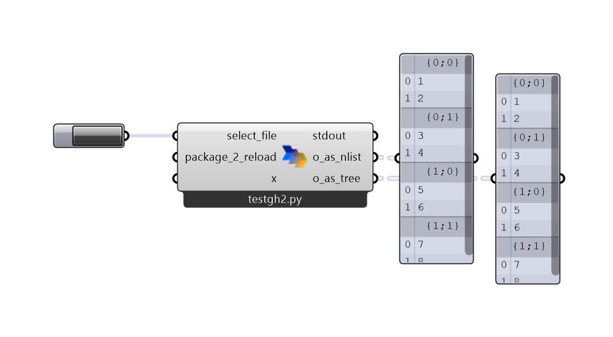

<p align="center">
    
</p>

<p align="center">
    
    
    
    
    
</p>

# script-sync

**What is it?** Script-sync plug-in to run C# and Python (IronPython or CPython) scripts directly from VSCode into Rhino and Grasshopper. This project is a research utility from the [IBOIS lab](https://www.epfl.ch/labs/ibois/) at EPFL. It was developed and currently maintained by [Andrea Settimi](https://github.com/9and3).

**Why Script-sync?** Although Rhino8 has a wonderful IDE, we often miss the nice extensions and functions of a full-fledged IDE like VSCode. Script-sync allows you to run your scripts directly from VSCode, while keeping the Rhino/Grasshopper environment open. This is particularly useful if you have *AI-assisted* (e.g. GithubCoPilot) code completion.

You can execute the folloing languages from VSCode with script-sync:

|               | CPython | IronPython  | C# |
| ------------- | ------  | ----------- | -- |
| Rhino         | ✅      | ✅          | ✅|
| Grasshopper   | ✅      |             |    |


<br>

<p float="left">
  <figure>
    
    <figcaption><i>Script-sync in Rhino</i></figcaption>
  </figure>

  <figure>
    
    <figcaption><i>Script-sync in Grasshopper</i></figcaption>
  </figure>
</p>


## Installation
🦏/🦗 **`Rhino/Grasshopper`**: Install script-sync rhino from food4rhino or the packageManager in Rhino (name: "script-sync"). For Grasshopper you might want to get rid of the old version of the plugin before installing the new one. Just right-click on the old icon and click *delete*.

👩‍💻 **`VScode`**: Install script-syncVSCode extension from the VSCode extension marketplace (name: "script-sync")

## How to use
🦏 **`Rhino`**: To start `script-sync` in RhinoV8, run the command `ScriptSyncStart` in RhinoV8. This will start a server that listens to commands from VSCode.
To close `script-sync` in RhinoV8, run the command `ScriptSyncStop` in RhinoV8.

🦗 **`Grasshopper`**: To start `script-sync` in Grasshopper, add the component script-sync: 
- <code>select_file</code>: click to open a file explorer and connect a script,
- <code>package_2_reload</code>: this can be empty in 90% of the cases, but if you develop a custom pypi package, (installed with editable pip mode) you can add the name of the package you are developing here to track the changes in its modules. Otherwise leave it empty.
- <code>x</code>: classical input parameter, you can add more, 
- <code>stdout</code>: all errors and print() is deviated here, 
- <code>a</code>: classical output parameter, you can add more.

<p  align="center">
    
</p>

> [!TIP]
> `script-sync` automatically converts lists and nested lists to Grasshopper data trees. Just return the python list as value. It also supports the `ghpythonlib.treehelpers` module. Example:
> ```python
>   # option 1
>   py_nlist = [
>       [[1, 2], [3, 4]],
>       [[5, 6], [7, 8]]
>   ]
>
>   # options 2
>   import ghpythonlib.treehelpers as th
>   gh_tree = th.list_to_tree(py_nlist)
>
>   o_as_nlist = py_nlist
>   o_as_tree = gh_tree
> ```
> <p  align="center">
>    
> </p>


👩‍💻 **`VScode`**: Open a script in VSCode and run it in RhinoV8 by pressing `F4` to run in Rhino or `shift+F4` for Grasshopper.
For Python files, add a `shebang` to the first line of the file to specify the interpreter to use, e.g.:
* `#! python3` to interpret it with CPython
* ⚠️ `#! python2` to interpret it with IronPython (only in Rhino)

> [!TIP]
> If you want your script-sync VSCode extension to automatically update, you should thick the autoinstall box:
> 
> 

## Requirements
The plug-in needs to be installed on RhinoV8, Grasshopper and VSCode

## Issues
For bugs open an issue on the [GitHub repo](https://github.com/ibois-epfl/script-sync/issues).

## Contribution
All contributions are welcome. Have a look at the [contribution guidelines](CONTRIBUTING.md).

## References
There are a lot of plug-ins that allow to run Python in Rhino. Among them, [CodeListener](https://github.com/ccc159/CodeListener) was working until RhinoV8 and it was a source of inspiration for this project. This is a simplified version, but it can run `C#` and both `IronPython` and `CPython` in RhinoV8.

# For code maintainers
Packages are published (`.yak` and `.vsix`)  automatically when a GitHub release is created.
